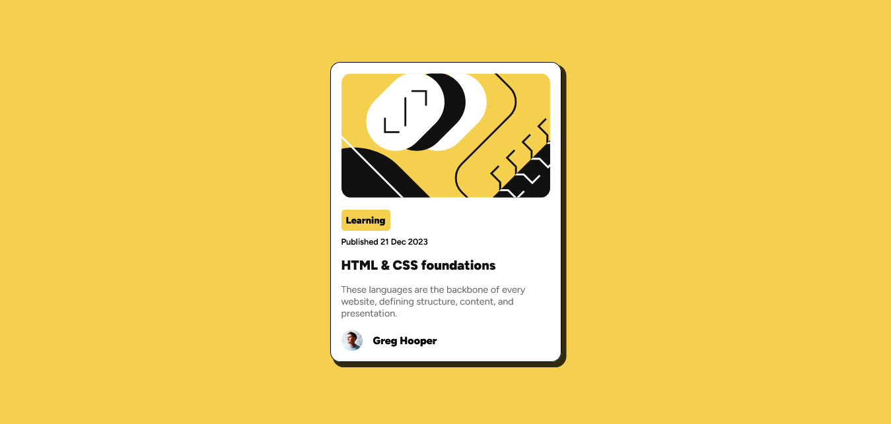

# Frontend Mentor - Blog preview card solution

This is a solution to the [Blog preview card challenge on Frontend Mentor](https://www.frontendmentor.io/challenges/blog-preview-card-ckPaj01IcS). Frontend Mentor challenges help you improve your coding skills by building realistic projects.

## Table of contents

- [Overview](#overview)
  - [Screenshot](#screenshot)
  - [Links](#links)
- [My process](#my-process)
  - [Built with](#built-with)
  - [What I learned](#what-i-learned)
- [Author](#author)

## Overview

### The challenge

Users should be able to:

- See hover and focus states for all interactive elements on the page

### Screenshot



### Links

- Live Site URL: [https://alfizain.github.io/blog-preview-card/](https://alfizain.github.io/blog-preview-card/)

## My process

### Built with

- Semantic HTML5 markup
- CSS
- Flexbox

### What I learned

```css
@font-face {
  font-family: "Figtree";
  src: url("../assets/fonts/Figtree-VariableFont_wght.ttf") format("truetype");
  font-weight: 100 900;
  font-style: normal;
}
```

## Author

- Website - [Muhammad Alfi Zain](https://alfizain.github.io/AlfiZain/)
- Frontend Mentor - [@AlfiZain](https://www.frontendmentor.io/profile/AlfiZain)
